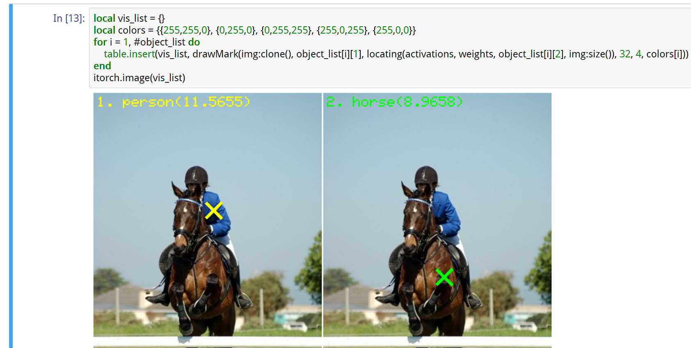

<h1>Soft Proposal Networks<br>for Weakly Supervised Object Localization</h1>

[](https://github.com/ZhouYanzhao/SPN/tree/torch) [](#) [](#)

[[Home]](http://yzhou.work) [[Project]](http://yzhou.work/SPN) [[Paper]](https://arxiv.org/pdf/1709.01829) [[More Resources]](http://yzhu.work/spn)


## Torch Implementation
The [torch branch](https://github.com/ZhouYanzhao/SPN/tree/torch) contains:

* the official **torch** implementation of SPN.
* the PASCAL-VOC point-based localization demo.

Please follow the instruction below to install it and run the experiment demo.

### Prerequisites
* Linux (tested on ubuntu 14.04LTS)
* NVIDIA GPU + CUDA CuDNN
* [Torch7](http://torch.ch/docs/getting-started.html)
* [Jupyter Notebook](http://jupyter.org/install.html)

### Getting started
You can setup everything via a single command `wget -O - https://git.io/v5wTS | bash` **or** do it manually in case something goes wrong:

1. install the dependencies (required by the demo code):
    * [loadcaffe](https://github.com/szagoruyko/loadcaffe)    
    * [torchnet](https://github.com/torchnet/torchnet): `luarocks install torchnet`
    * [optnet](https://github.com/fmassa/optimize-net): `luarocks install optnet`

2. clone the torch branch: 

    ```bash
    # git version must be greater than 1.9.10
    git clone https://github.com/ZhouYanzhao/SPN.git -b torch --single-branch SPN.torch
    cd SPN.torch
    export DIR=$(pwd)
    ```

3. install SPN: 

    ```bash
    cd $DIR/install
    # install the GPU implementation of SPN.
    bash install.sh
    ```

4. download the PASCAL-VOC2007 dataset:

    ```bash
    cd $DIR/demo/datasets
    # trainval
    wget http://host.robots.ox.ac.uk/pascal/VOC/voc2007/VOCtrainval_06-Nov-2007.tar
    tar xvf  VOCtrainval_06-Nov-2007.tar
    # test
    wget http://host.robots.ox.ac.uk/pascal/VOC/voc2007/VOCtest_06-Nov-2007.tar
    tar xvf VOCtest_06-Nov-2007.tar
    ```

5. download pre-trained VGGNet model for fine-tuning:

    ```bash
    cd $DIR/demo/models/convert
    wget http://www.robots.ox.ac.uk/~vgg/software/very_deep/caffe/VGG_ILSVRC_16_layers.caffemodel
    # convert caffemodel to t7
    th convertVGG.lua
    ```

6. run the demo experiment:

    ```bash
    cd $DIR/demo
    bash ./scripts/Train_PASCAL.sh
    ```

7. visualize locating samples via [Exp/notebooks/vis.ipynb](Exp/notebooks/vis.ipynb)


### Troubleshooting
If you run into `error: identifier "THCudaBlas_Sgemv" is undefined` during installation, update Torch7 to the latest version via `cd <TORCH_DIR> && bash ./update.sh`

## PyTorch Implementation
coming

## Caffe Implementation
coming

## Citation 
If you use the code in your research, please cite:
```bibtex
@INPROCEEDINGS{Zhu2017SPN,
    author = {Zhu, Yi and Zhou, Yanzhao and Ye, Qixiang and Qiu, Qiang and Jiao, Jianbin},
    title = {Soft Proposal Networks for Weakly Supervised Object Localization},
    booktitle = {ICCV},
    year = {2017}
}
```